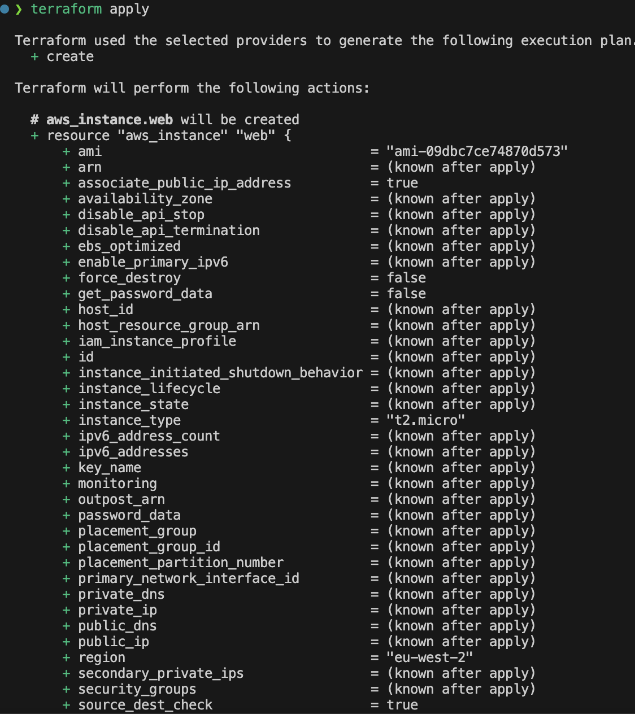
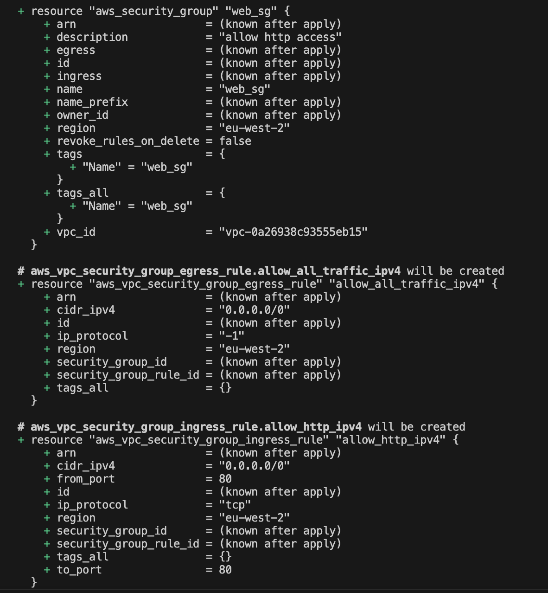
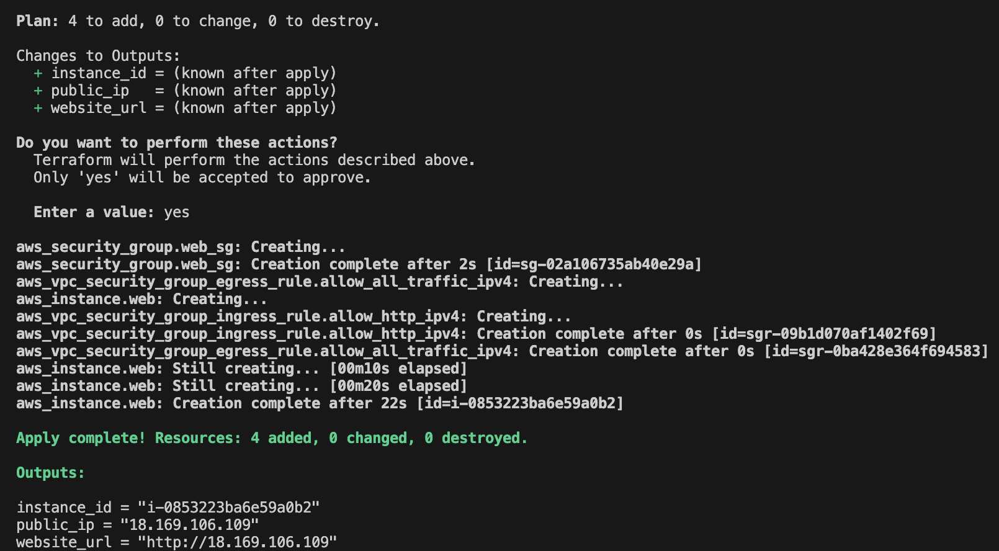
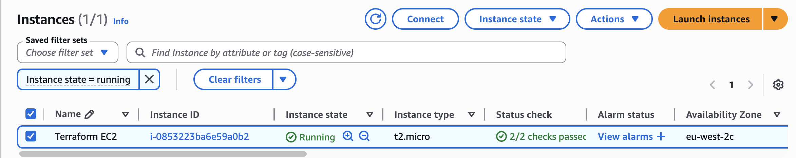
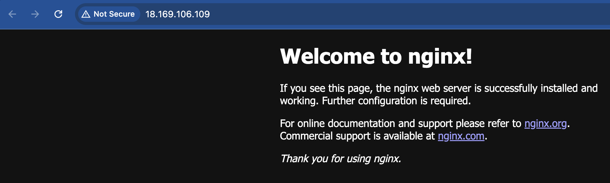

# EC2 Cloud-Init Deployment (Terraform)

## Overview

For this project, I used Terraform to deploy an EC2 instance on AWS and configure it automatically using a cloud-init file.

The aim was to create a fully automated deployment where the instance is immediately ready to serve traffic without any manual configuration after launch.

## What I Built

- Deployed an Ubuntu EC2 instance using Terraform
- Created a security group allowing HTTP access on port 80
- Used a cloud-init YAML file to configure the instance during boot
- Installed and started NGINX automatically
- Made the web server accessible publicly through the instance public IP

## Architecture

This project consists of:

- AWS EC2 instance
- Security group allowing inbound HTTP traffic
- Cloud-init for automated server configuration
- Terraform for infrastructure provisioning and management

## Terraform Structure

The project is split into separate files to keep the configuration organised and easier to manage.

```text
.
├── provider.tf
├── main.tf
├── variables.tf
├── terraform.tfvars
├── outputs.tf
├── cloud-init.yaml
├── screenshots/
└── README.md
```

### File Breakdown

- `provider.tf` → AWS provider configuration
- `main.tf` → EC2 instance and security group resources
- `variables.tf` → input variable definitions
- `terraform.tfvars` → values assigned to variables
- `outputs.tf` → useful deployment outputs
- `cloud-init.yaml` → automated boot-time configuration

## Cloud-Init Configuration

The cloud-init file is passed into the EC2 instance using Terraform `user_data`.

On boot, the instance:

- Updates package lists
- Installs NGINX
- Enables the NGINX service
- Starts the NGINX service automatically

This removes the need for any manual SSH configuration after deployment.

## Deployment Workflow

Initialise Terraform:

```bash
terraform init
```

Review the execution plan:

```bash
terraform plan
```

Deploy the infrastructure:

```bash
terraform apply
```

Once deployment completes, access the server using:

```text
http://<public-ip>
```

## Outputs

Terraform returns several useful outputs after deployment:

- Instance ID
- Public IP address
- Website URL

## Screenshots

### Terraform Plan



### Security Group Plan



### Terraform Apply Success



### EC2 Instance Running



### Security Group Configuration


### NGINX Working



## Issues Encountered

One issue encountered during deployment was the site initially failing to load correctly.

This happened because the browser attempted to use HTTPS by default, while only HTTP (port 80) had been configured within the security group.

The issue was resolved by explicitly accessing the instance using:

```text
http://<public-ip>
```

Another issue encountered was slower instance startup caused by unnecessary package upgrades in the cloud-init configuration. Simplifying the cloud-init file improved deployment speed and reliability.

## What I Learned

- How Terraform provisions infrastructure on AWS
- How cloud-init automates EC2 configuration during boot
- The difference between HTTP and HTTPS in practice
- Why explicit subnet and networking configuration matters
- How to debug Terraform and EC2 deployment issues using AWS system logs
